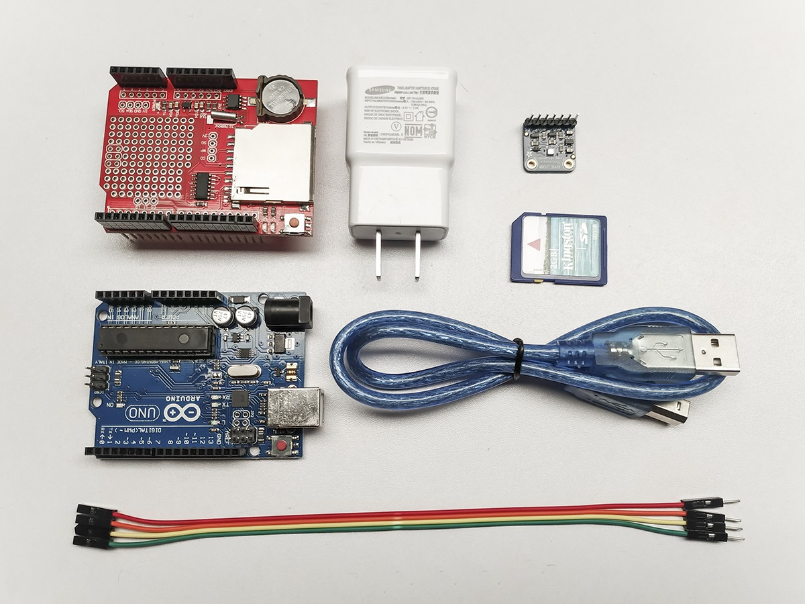

# datalogger-conservacion
Proyecto de fabricación de un datalogger casero para ser usado en la conservación de documentos en archivos, bibliotecas y museos

[Sensor SHT-30](https://www.adafruit.com/product/5064)
