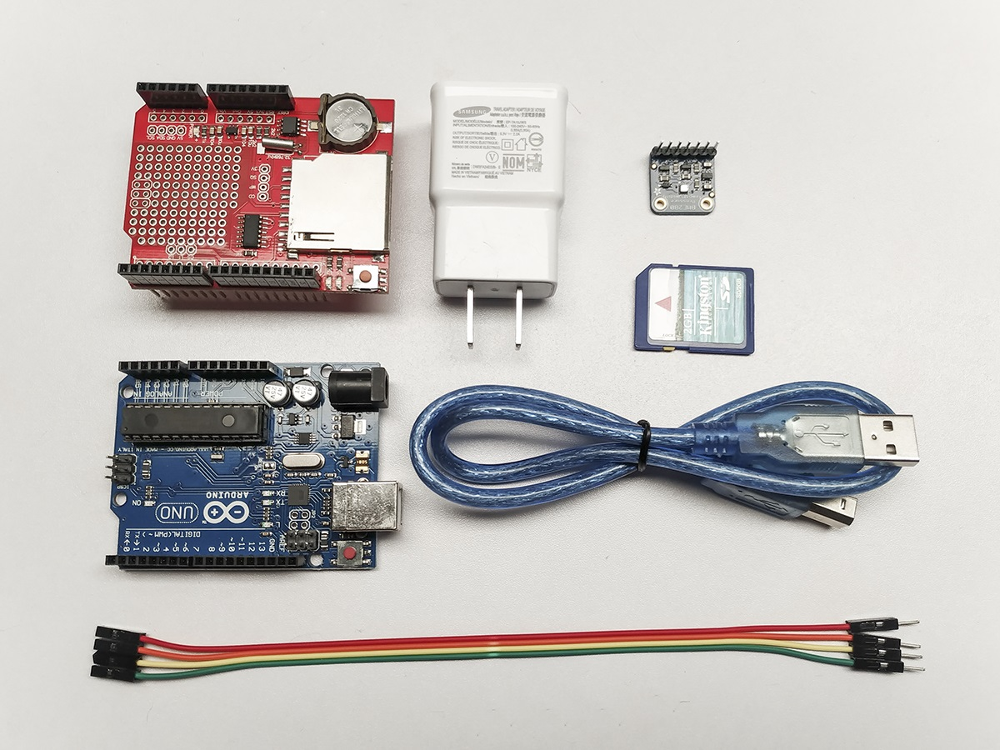
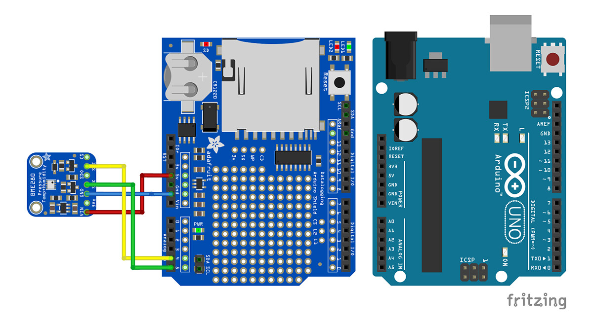
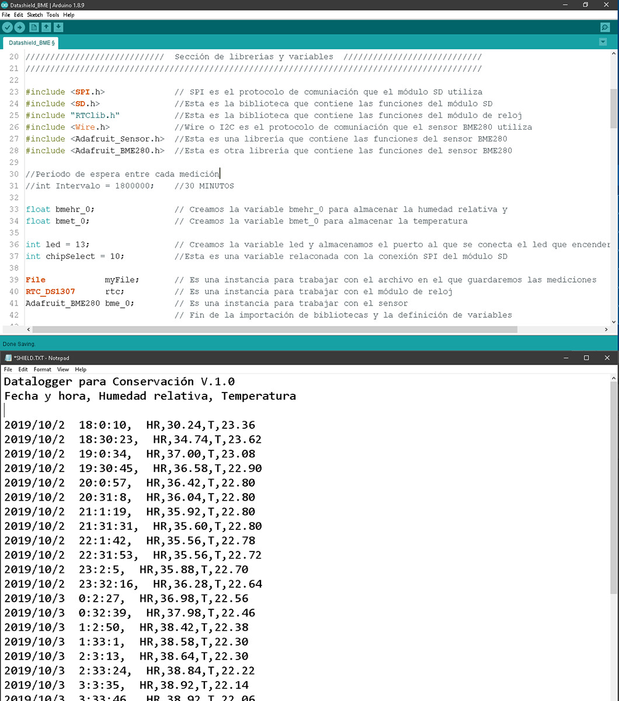

# datalogger-conservacion

Guía para la fabricación de un datalogger para la conservación preventiva en archivos, bibliotecas y museos

# Indice

- [Descripcion general](#descripcion-general)
- [Componentes](#componentes)
- [Fabricación](#fabricacion)
- [Librerias](#librerias)
- [Programación](#programacion)

# Descripcion general

Dentro de la disciplina de la conservación de bienes culturales, una de las estrategías más efectivas para minimizar su deterioro es el [ Monitoreo y Control](http://www.bnm.unam.mx/files/quienes-somos/preservacion-documental/norma-mexicana-preservacion-documental.pdf) de los [Agentes de deterioro](https://www.cncr.gob.cl/noticias/agentes-de-deterioro-instituto-canadiense-de-conservacion-icc).

Para ello se utiliza un datalogger, que es un aparato que mide, almacena y muestra los valores de estos agentes a lo largo del tiempo, los más comunes permiten medir la humedad relativa y la temperatura, aunque algunos otros también cuentan con sensores de radiación visible y ultravioleta, o de contaminantes gaseosos y partículas solidas. Existen marcas y modelos de [dataloggers especiales para la conservación](https://www.universityproducts.com/equipment-tools/temperature-and-humidity-monitoring-equipment) de gran calidad pero que no son accesibles a muchas instituciones en Lationamerica debido a su alto costo. Actualmente el más economico cuesta $3,000 pesos mexicanos (enero 2023).

Aquí se ofrece una alternativa para construir un datalogger que mida la humedad relativa y temperatura, que sea accesible, confiable y sostenible. Este datalogger se ubica al mismo nivel que los dataloggers comerciales y su costo es de alrededor de $800 pesos mexicanos, una fracción del costo de los otros dataloggers.

Para conocer más sobre este proyecto puedes leer el artículo [Tecnología maker y su aplicación en conservación](https://www.academia.edu/43988917/Tecnología_maker_y_su_aplicación_en_conservación_V_Coloquio_Conservación_y_Restauración_Lozano)

# Componentes

El componente más importante es el sensor, en él recae buena parte de la confiabilidad del datalogger, por lo que vale la pena invertir en uno que sea de buena calidad en un proveedor confiable. En este proyecto se han usado dos diferentes:

- [Bosch® BME280](https://mexico.newark.com/c/computadoras-embebidas-educacion-tarjetas-de-fabricante/arduino?st=bme280&showResults=true)
- [Sensirion® SHT31](https://www.mouser.mx/c/?q=sht31)

El resto de los componentes necesarios para su construcción son mínimos y pueden adquirirse vía internet:

- [Arduino Uno](https://listado.mercadolibre.com.mx/arduino-uno#D)
- [Datalogger shield](https://listado.mercadolibre.com.mx/datalogger-shield#D)
- [Cargador USB](https://listado.mercadolibre.com.mx/cargador-usb#D)
- [Pantalla I2C](https://listado.mercadolibre.com.mx/pantalla-i2c#D) \*opcional

# Fabricación

La fabricación es muy sencilla ya que los componentes son mínimos, unicamente se debe ensamblar el Datalogger shield sobre el Arduino Uno teniendo cuidado de que todos los pines entren correctamente.

Los sensores son del tipo I2C por lo que se requieren 4 cables tipo Dupont del tipo macho-hembra para conectarlo. Las conexiones son: GND, VCC, SDA y SCL, el resultado debe quedar como indica el esquema de abajo.

Para proteger los componentes se pude imprimir en 3D una carcasa o bien se puede colocar el datalogger dentro de un contenedor de plástico

# Librerias

Para establecer comunicación entre la computadora y el Arduino se necesita instalar el programa Arduino IDE, en esta [guía](https://programarfacil.com/blog/arduino-blog/arduino-ide/) puedes ver como se instala.

Si tienes problemas puedes probar instalando el controlador para windows que se encuentra en la carpeta [controlador](controlador/)

Adicionalmente los diferentes componentes necesitan varias librerias para funcionar correctamente por lo que será necesario instalar cada una de ellas antes de cargar el codigo al Arduino Uno. La instalación se hcae desde el Gestor de librerias, [aquí](https://programarfacil.com/blog/arduino-blog/instalar-una-libreria-de-arduino/) te muestran como.

En caso de que las necesites también las puedes encontrar en la carpeta [librerias](librerias/)

# Programacion

El código se compone de tres partes, la sección de librerías y variables, la sección de configuración y la sección del ciclo.

Los archivos listos para subirse al arduino se encuentra en dos carpetas, dependiendo cual de los sensores hayas elegido usar, también dependiendo de si se utiliza la pantalla LCD o no.

- [Bosch® BME280](datashield_BME280/)
- [Sensirion® SHT31 con pantalla LCD](datashield_SHT31_LCD/)

El datalogger realiza una medición cada 30 minutos y almacena los datos en un archivo de texto con formato de valores separados por coma (\*.CSV) que se puede abrir desde cualquier programa de hoja de cálculo o editor de texto.

Los datos se almacenan bajo la siguiente estructura: año/mes/día hora:minuto:segundo, HR, valor, T, valor. En donde la fecha y la hora se expresa numéricamente en formato de 24 horas y los valores de humedad relativa y temperatura consisten en números con dos decimales.

